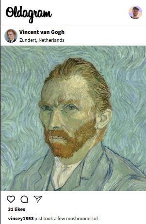

# Instagram Clone Solo Project
This is the instagram clone solo project for the scrimba full stack developer course! This is my attempt! 

## Site Preview
Here is a preview of the site!

### Live site
Find the link to the live site [here](https://mrjgee.github.io/Instagram-Clone-Solo-Project/)

## Tools used
Here is a list of the tools used:

* HTML
* CSS
* Vanilla Javascript

## About Scrimba

At Scrimba our goal is to create the best possible coding school at the cost of a gym membership! 💜
If we succeed with this, it will give anyone who wants to become a software developer a realistic shot at succeeding, regardless of where they live and the size of their wallets 🎉
The Fullstack Developer Path aims to teach you everything you need to become a Junior Developer, or you could take a deep-dive with one of our advanced courses 🚀

- [Our courses](https://scrimba.com/courses)
- [The Frontend Career Path](https://scrimba.com/fullstack-path-c0fullstack)
- [Become a Scrimba Pro member](https://scrimba.com/pricing)

